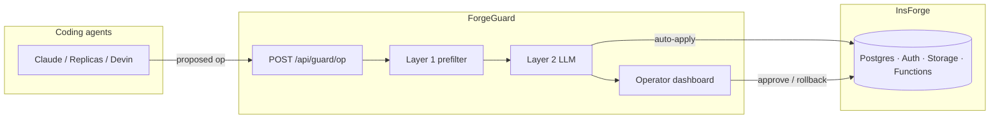
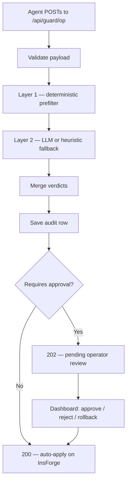

# ForgeGuard

**The reliability & observability control plane for agent-built backends on [InsForge](https://insforge.dev).**

> An AI agent can ship a full-stack app in minutes — and drop your production table in seconds. **ForgeGuard is the seatbelt.**

[](https://insforge.dev)

---

## Contents

- [What it does](#what-it-does)
- [Architecture](#architecture)
- [Guard pipeline](#guard-pipeline)
- [Quick start](#quick-start)
- [Demo dashboard](#demo-dashboard)
- [API reference](#api-reference)
- [Configuration](#configuration)
- [Production deployment](#production-deployment)
- [For coding agents](#for-coding-agents)
- [Integrations](#integrations)
- [Development](#development)
- [Project layout](#project-layout)

---

## What it does

Coding agents propose backend changes (SQL migrations, function deploys, storage/auth config). ForgeGuard sits **in front of InsForge** as a single chokepoint:

1. **Classifies** every op (deterministic rules + optional LLM)
2. **Logs** a full audit trail with severity, rationale, and blast radius
3. **Auto-allows** safe ops or **holds** risky ones for human review
4. **Applies or rolls back** on InsForge when approved

| Capability | What you get |
|------------|--------------|
| **Audit trail** | Who proposed what, when, with severity and rationale |
| **Guardrails** | Layer 1 prefilter → Layer 2 classifier → operator gate |
| **Dashboard** | Live log with approve, reject, rollback, and cinematic demo |
| **Rollback** | Compensating SQL or InsForge preview branches |

**Stack:** Next.js 15 · InsForge · Vercel  
**Op types:** `db.migration` · `function.deploy` · `storage.config` · `auth.config`

---

## Architecture



**Editable diagrams (Excalidraw):** open in [excalidraw.com](https://excalidraw.com) or the VS Code extension.

| Diagram | File |
|---------|------|
| System overview | [docs/diagrams/forgeguard-architecture.excalidraw](./docs/diagrams/forgeguard-architecture.excalidraw) |
| Guard pipeline | [docs/diagrams/forgeguard-guard-pipeline.excalidraw](./docs/diagrams/forgeguard-guard-pipeline.excalidraw) |

See [docs/diagrams/README.md](./docs/diagrams/README.md) for export instructions.

---

## Guard pipeline

Every proposed operation follows the same path:



**Safe example** — `ADD COLUMN nickname` → **200**, applied immediately.  
**Risky example** — `DROP COLUMN last_login` → **202**, blocked with `rationale`, `blast_radius`, and `safer_alternative` until an operator approves.

---

## Quick start

No credentials required for local demo.

```bash
git clone https://github.com/madhukoseke/ForgeGuard.git
cd ForgeGuard
npm install
npm run dev
```

| URL | Purpose |
|-----|---------|
| [localhost:3000](http://localhost:3000) | Landing page |
| [localhost:3000/dashboard](http://localhost:3000/dashboard) | Operator dashboard + demo |

Default mode uses an **in-memory store** and **heuristic classifier** — works fully offline.

---

## Demo dashboard

Open the [operator dashboard](http://localhost:3000/dashboard).

| Action | Shortcut |
|--------|----------|
| Run 6-scene cinematic demo | `D` or **Run demo** |
| Simulate canned ops | `1`–`8` or click a row |
| Seed all demo ops | `S` |
| Reset audit trail | `X` |
| Approve first pending op | `A` |
| Rollback last applied op | `R` |

Recording guide: [docs/DEMO_SCRIPT.md](./docs/DEMO_SCRIPT.md)

**Headless verification:**

```bash
npm run demo:e2e    # 6-scene cinematic flow
npm run e2e         # full API lifecycle (approve, rollback, reject)
```

---

## API reference

### Submit a proposed operation

Agents must POST here **before** touching InsForge.

```bash
curl -X POST http://localhost:3000/api/guard/op \
  -H 'content-type: application/json' \
  -d '{
    "operation_type": "db.migration",
    "statement": "ALTER TABLE users DROP COLUMN last_login;",
    "agent": "claude-code",
    "target": "users",
    "context": { "table": "users", "row_count": 5, "environment": "production" }
  }'
```

| HTTP | Meaning |
|------|---------|
| **200** | Auto-allowed and applied (or simulated locally) |
| **202** | Pending — includes `rationale`, `blast_radius`, `safer_alternative` |

### List audit trail

```bash
curl 'http://localhost:3000/api/actions?limit=50&offset=0'
```

Returns `actions`, `pagination`, and `summary` (counts for filters).

### Review an action

```bash
curl -X PATCH http://localhost:3000/api/actions/<id> \
  -H 'content-type: application/json' \
  -d '{ "decision": "approve", "reviewed_by": "operator" }'
```

| `decision` | Effect |
|------------|--------|
| `approve` | Apply on InsForge (uses safer SQL when `apply_safer: true`) |
| `reject` | Mark rejected, no changes applied |
| `rollback` | Revert a previously applied op |

### Health check

```bash
curl http://localhost:3000/api/health
```

---

## Configuration

Copy `.env.example` → `.env.local`. All variables are optional for local demo.

<details>
<summary><strong>Environment variables</strong></summary>

| Variable | Purpose |
|----------|---------|
| `FORGEGUARD_STORE` | `memory` (default) or `insforge` |
| `FORGEGUARD_EXECUTOR` | `simulated` (default), `insforge`, or `migrations` |
| `FORGEGUARD_BRANCH_MODE` | `cli` for preview-branch rollback (local only) |
| `INSFORGE_URL` / `INSFORGE_KEY` | InsForge project credentials |
| `OPENROUTER_API_KEY` | Layer 2 LLM classifier |
| `INSFORGE_MODEL_GATEWAY_URL` | Model gateway base (default: OpenRouter) |
| `FORGEGUARD_MODEL` | Model id for classifier |
| `FORGEGUARD_OPERATOR_TOKEN` | Protect API routes (required in production) |
| `FORGEGUARD_BASE_URL` | Target URL for `seed` / E2E scripts |
| `REPLICAS_WEBHOOK_SECRET` | Verify Replicas webhook signatures |
| `LIM_API_KEY` / `LIMRUN_INSTANCE_ID` | Limrun mobile preview for pending ops |
| `MEMOIR_WEBHOOK_URL` | Optional outbound events |

</details>

**Bootstrap InsForge** (applies `sql/schema.sql`):

```bash
npm run bootstrap:insforge
```

Then set `FORGEGUARD_STORE=insforge` and `FORGEGUARD_EXECUTOR=insforge`.

**Auth:** When `FORGEGUARD_OPERATOR_TOKEN` is set, send `Authorization: Bearer <token>` or `x-forgeguard-token: <token>` on protected routes. In production (Vercel / `NODE_ENV=production`), the token is required.

---

## Production deployment

Before deploying with real InsForge credentials:

1. Set **`FORGEGUARD_OPERATOR_TOKEN`** — strong secret for API and dashboard
2. Set **`FORGEGUARD_STORE=insforge`** and **`FORGEGUARD_EXECUTOR=insforge`** — memory store is ephemeral on serverless
3. Set **`REPLICAS_WEBHOOK_SECRET`** if using `POST /api/webhooks/replicas`
4. Run **`npm run bootstrap:insforge`** on your InsForge project

```bash
vercel link && vercel --prod
```

Set env vars in the Vercel dashboard (see `.env.example`).

---

## For coding agents

**Do not** apply migrations, deploy functions, or change storage/auth config directly on InsForge.

1. POST every proposed change to **`/api/guard/op`**
2. If response is **`applied`** (200) — proceed (or apply yourself in simulated mode)
3. If **`pending`** (202) — stop, show `rationale` and `safer_alternative` to the operator, wait for approval

---

## Integrations

| Partner | Role | Docs |
|---------|------|------|
| **InsForge** | Target backend — apply, rollback, audit persistence | Core (this README) |
| **[Replicas](https://tryreplicas.com/)** | Background agents POST ops before InsForge changes | [docs/REPLICAS.md](./docs/REPLICAS.md) |
| **[Limrun](https://lim.run/)** | Mobile preview URL for pending ops (medium+ severity) | Set `LIM_API_KEY` |
| **[Memoir](https://www.trymemoir.ai/)** | Optional outbound events | [docs/MEMOIR.md](./docs/MEMOIR.md) |

**Replicas webhook:** `POST /api/webhooks/replicas`

---

## Development

```bash
npm test                 # 47 unit tests
npm run e2e              # guard API E2E
npm run e2e:replicas     # Replicas webhook E2E
npm run demo:e2e         # cinematic demo E2E
npm run bootstrap:insforge
npm run integration:insforge
npm run precommit        # typecheck + lint + test + build
```

---

## Project layout

```
app/
  (marketing)/page.tsx      Landing
  dashboard/page.tsx        Operator UI
  api/guard/op/             Agent chokepoint
  api/actions/              Audit log + review
  api/demo/                 Demo seed / reset
  api/webhooks/replicas/    Replicas enrichment

lib/
  prefilter.ts              Layer 1 rules
  classifier.ts             Layer 2 LLM / heuristic
  guard.ts                  Orchestration
  executor.ts               InsForge apply / rollback
  store.ts                  Memory or InsForge persistence

components/dashboard/       Dashboard UI components
hooks/                      Dashboard data + demo hooks
docs/diagrams/              Excalidraw architecture diagrams
sql/schema.sql              Postgres schema for InsForge
```

---

## License

MIT — see [LICENSE](./LICENSE).
