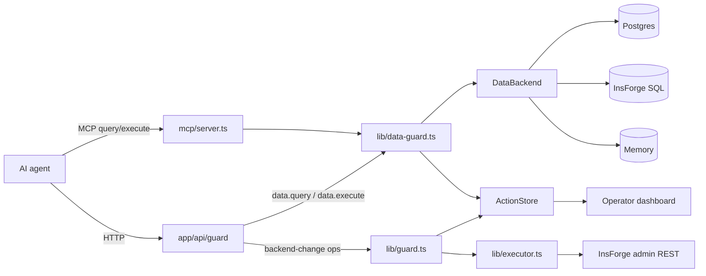
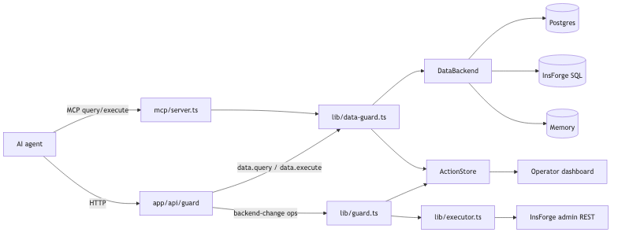
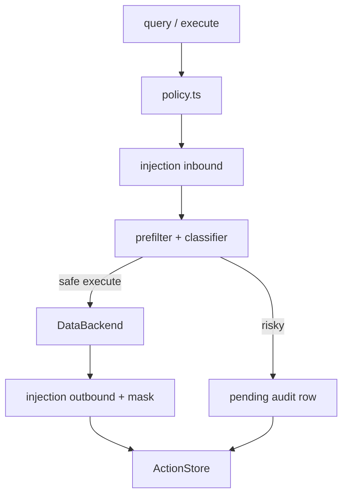
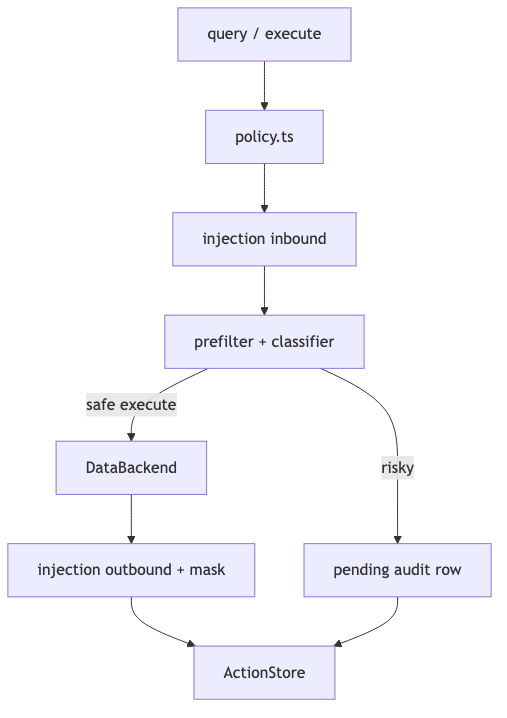

# ForgeGuard architecture

Mental model for contributors: which file to open, and why two “guards” exist.

For the product pitch and operator quick start, see the [README](../README.md). Editable Excalidraw sources live in [diagrams/](./diagrams/).

---

## System overview

Rendered overview (same story as the Excalidraw source):

---

## Two orchestrators

| Module | Op types | Entry points | Apply path |
|--------|----------|--------------|------------|
| [`lib/data-guard.ts`](../lib/data-guard.ts) | `data.query`, `data.execute` | MCP `query` / `execute`; `POST /api/guard/query` · `/execute` · `/op` | [`DataBackend`](../lib/backends/) (`query` / `execute`) |
| [`lib/guard.ts`](../lib/guard.ts) | `db.migration`, `function.deploy`, `storage.config`, `auth.config` | `POST /api/guard/op` | [`applyOp`](../lib/insforge-executor.ts) → [`lib/executor.ts`](../lib/executor.ts) |

**Why split:** data ops share policy, bidirectional injection scanning, and SQL backends. Backend-change ops need InsForge admin REST, branch/preview enrichment, and compensating-SQL snapshots that are not part of the MCP data path. Both write the same audit store (`agent_actions`).

MCP tools: `query`, `execute`, `propose_operation` (backend-change + optional data.*), `list_tables`, `describe_table`, `list_actions`, `get_action_status`. Approve/reject/rollback remain HTTP/dashboard — see [API_STABILITY.md](./API_STABILITY.md).

---

## Guard pipeline (data path)

Layer 1 ([`prefilter.ts`](../lib/prefilter.ts)) is deterministic destructive-SQL rules. Layer 2 ([`classifier.ts`](../lib/classifier.ts)) is LLM or heuristic severity / safer alternative. Merge rules and approval thresholds live in [`lib/types.ts`](../lib/types.ts) (`computeRequiresApproval`).

---

## Three independent axes

Defaults always fall back to memory / simulated so `npm run dev` and `npm run mcp` work with zero credentials ([ADR-002](./adr/002-simulated-default-executor.md), [ADR-003](./adr/003-memory-store-demo-default.md)). Set `FORGEGUARD_STRICT_CONFIG=1` so `/api/readiness` fails closed when production config is incomplete.

| Axis | Env | Resolves in | Values |
|------|-----|-------------|--------|
| **Data backend** | `FORGEGUARD_BACKEND` (+ `DATABASE_URL` / InsForge) | [`lib/backends/index.ts`](../lib/backends/index.ts) | `memory` · `postgres` · `insforge` |
| **Audit store** | `FORGEGUARD_STORE` | [`lib/store.ts`](../lib/store.ts) | `memory` · `postgres` · `insforge` |
| **Executor** | `FORGEGUARD_EXECUTOR` | [`lib/insforge-client.ts`](../lib/insforge-client.ts) | `simulated` · `insforge` · `migrations` |

Memory backends keep state on `globalThis` so Next.js HMR does not wipe the demo trail.

---

## InsForge layering

Four files touch InsForge; each has a different job:

| File | Role |
|------|------|
| [`lib/backends/insforge.ts`](../lib/backends/insforge.ts) | **SQL** — `DataBackend` for `query` / `execute` against InsForge Postgres |
| [`lib/insforge-client.ts`](../lib/insforge-client.ts) | **Admin REST** — migrations, functions, storage, auth, branches |
| [`lib/executor.ts`](../lib/executor.ts) | **Apply / rollback semantics** — per op type (`db.migration`, `auth.config`, `storage.config`, `function.deploy`) plus simulated mode |
| [`lib/insforge-executor.ts`](../lib/insforge-executor.ts) | **Route facade** — re-exports `applyOp` / `rollbackOp` for API routes |

`executor.ts` is large on purpose today (one dispatcher + four op families). Prefer editing the matching `apply*Live` / `rollback*Live` section rather than inventing a parallel path.

---

## Where to edit

| Goal | Start here |
|------|------------|
| MCP tool behavior | [`mcp/server.ts`](../mcp/server.ts) → `data-guard.ts` |
| HTTP data guard | [`app/api/guard/query`](../app/api/guard/query/) · [`execute`](../app/api/guard/execute/) |
| Backend-change ops | [`lib/guard.ts`](../lib/guard.ts) · [`app/api/guard/op`](../app/api/guard/op/) |
| Destructive SQL rules | [`lib/prefilter.ts`](../lib/prefilter.ts) |
| Severity / safer SQL | [`lib/classifier.ts`](../lib/classifier.ts) · [`lib/safer-sql.ts`](../lib/safer-sql.ts) |
| Injection patterns | [`lib/injection.ts`](../lib/injection.ts) ([ADR-001](./adr/001-fail-open-llm-scanning.md)) |
| Read-side policy | [`lib/policy.ts`](../lib/policy.ts) · `forgeguard.config.json` |
| Dashboard demo choreography | [`hooks/use-cinematic-demo.ts`](../hooks/use-cinematic-demo.ts) · [`lib/demo-ops.ts`](../lib/demo-ops.ts) |
| Canned demo ops | [`lib/demo-ops.ts`](../lib/demo-ops.ts) |

---

## Related docs

- [STABLE_0.3.0.md](./STABLE_0.3.0.md) — stable vs experimental
- [THREAT_MODEL.md](./THREAT_MODEL.md) — what ForgeGuard does and does not protect
- [adr/](./adr/) — fail-open LLM scan, simulated executor, memory store defaults
- [diagrams/](./diagrams/) — Excalidraw sources + PNG exports
