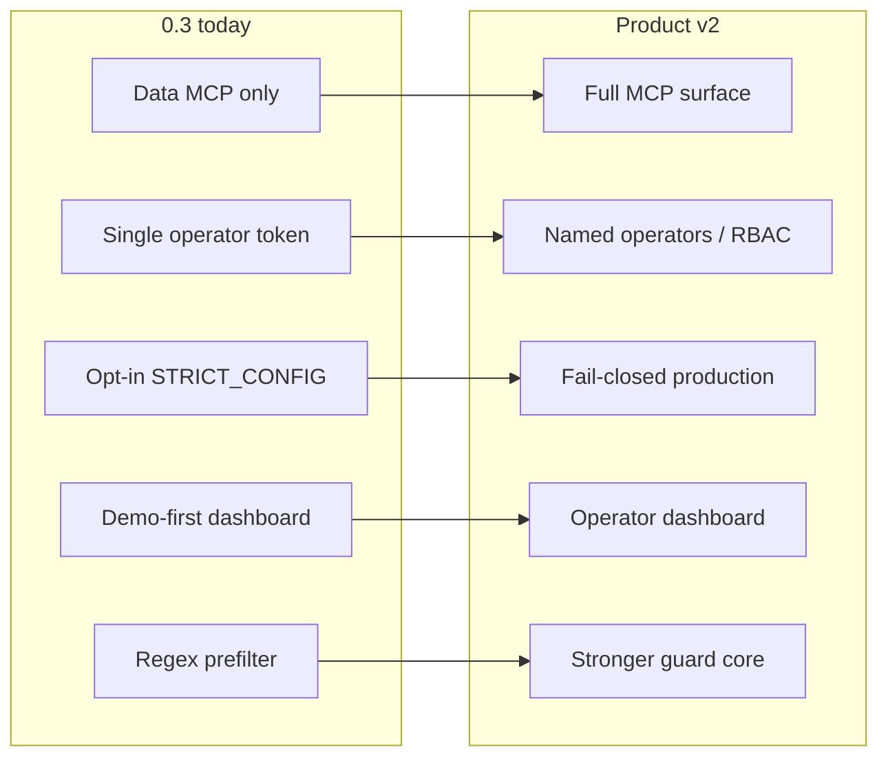

# ForgeGuard Product v2

**Status:** planning (0.3.x → capability leap)  
**North star:** Agents use ForgeGuard end-to-end as their database and backend-change tool; operators get trustworthy approvals and fail-closed production defaults — not just a great demo.

This is a **product** milestone, not necessarily npm `2.0.0`. Semver can stay on `0.x` / `1.0` while these themes ship. The docs’ older “v1 = npm `exports` map” item is **Phase F** below.

Related: [ARCHITECTURE.md](./ARCHITECTURE.md) · [THREAT_MODEL.md](./THREAT_MODEL.md) · [STABLE_0.3.0.md](./STABLE_0.3.0.md) · [ROADMAP.md](./ROADMAP.md)

---

## What 0.3 already gets right

- Seatbelt story and zero-credential demo on the real guard pipeline
- Stable MCP data path: `query`, `execute`, `list_tables`, `describe_table`, `get_action_status`
- Deterministic prefilter + classifier + bidirectional injection scan
- Honest threat model (regex limits, fail-open LLM, memory fallback)
- Explicit stable vs experimental split (live InsForge executor, partners, LLM scan)

---

## Gap → theme map

---

## Phases

Ship in order. Each phase should leave `main` releasable.

### Phase A — MCP parity (agent DX) — done

**Goal:** An MCP-only agent can propose backend ops and inspect the trail without dropping to curl.

| Add | Behavior |
|-----|----------|
| `propose_operation` | Same pipeline as `POST /api/guard/op` for backend-change (+ optional `data.*`) |
| `list_actions` | Recent audit rows (`status` / `limit` / `offset`) |
| `review_action` | Deferred — approve/reject stay dashboard / `PATCH /api/actions/[id]` |

**Done when:** Claude Desktop / Cursor can propose a migration and poll status without HTTP.

---

### Phase B — Fail-closed production

**Goal:** Misconfiguration cannot silently become a memory demo in production.

- Default `FORGEGUARD_STRICT_CONFIG` on when `isProduction()` (override with `=0` for emergency)
- No silent memory fallback when store/backend was explicitly set to `postgres` / `insforge` and credentials are missing — hard error or readiness 503
- Document migration for existing deploys that relied on soft fallback

**Files:** [`lib/readiness.ts`](../lib/readiness.ts), [`lib/store.ts`](../lib/store.ts), [`lib/backends/index.ts`](../lib/backends/index.ts), [`docs/DEPLOYMENT.md`](./DEPLOYMENT.md), [`docs/THREAT_MODEL.md`](./THREAT_MODEL.md), ADRs as needed

**Done when:** Production with `FORGEGUARD_STORE=postgres` and no `DATABASE_URL` fails readiness / refuses to serve mutations.

---

### Phase C — Operator identity (trustworthy approvals)

**Goal:** Approvals are attributable; not one shared secret pretending to be many people.

**MVP (C1):**
- Named API keys or operator profiles (`id`, `display_name`, hashed secret) — env or small table
- `reviewed_by` set server-side from authenticated identity (ignore client spoof)
- Dashboard: stop storing a single shared token in `localStorage` long-term; prefer session cookie or short-lived token after login prompt

**Later (C2):**
- Roles: `viewer` / `reviewer` / `admin` (demo reset = admin)
- Optional OIDC/SSO

**Files:** [`lib/api-auth.ts`](../lib/api-auth.ts), [`docs/ADMIN_TOKEN.md`](./ADMIN_TOKEN.md), [`app/api/actions/[id]/route.ts`](../app/api/actions/[id]/route.ts), dashboard fetch helpers

**Done when:** Audit rows show a real operator id that the client cannot forge.

---

### Phase D — Operator dashboard (beyond demo)

**Goal:** Real ops can find, act on, and export work — not only press `D`.

- Free-text + date + agent filters on the trail
- Bulk approve/reject for low-risk pending (with confirm)
- CSV/JSON export
- Alert on **pending** (webhook/Slack) — not only Memoir-on-applied
- Prefer SSE or shorter poll for pending count badge

**Files:** [`components/dashboard/`](../components/dashboard/), [`hooks/`](../hooks/), [`app/api/actions/`](../app/api/actions/), new notify helper

**Done when:** An operator can clear a backlog of 50 pending ops without one-click-per-row only, and get notified when something new needs review.

---

### Phase E — Stronger guard core

**Goal:** Close the documented regex bypass gap enough for serious production use.

- Introduce a real SQL parse path (e.g. `pgsql-ast-parser` / libpq-compatible) behind prefilter + policy table refs; keep regex as fallback
- Configurable approval threshold in `forgeguard.config.json` (not only ≥ medium)
- Session/agent rate + anomaly signals (many small writes) — advisory first
- Optional EXPLAIN / `count(*)` blast-radius for `execute` (behind flag)

**Files:** [`lib/prefilter.ts`](../lib/prefilter.ts), [`lib/policy.ts`](../lib/policy.ts), [`lib/classifier.ts`](../lib/classifier.ts), [`docs/THREAT_MODEL.md`](./THREAT_MODEL.md)

**Done when:** Threat model can say “AST-backed table/statement detection for Postgres dialect X” with residual risks listed.

---

### Phase F — Library API + schema hygiene (docs “v1”)

**Goal:** Embeddable core + one audit schema story.

- npm `exports` map for stable programmatic surface (`guardDataQuery` / `guardDataExecute` / `guardOp` / types)
- Unify `agent_actions` vs `forgeguard_actions` via versioned migrations
- Optional `@forgeguard/types` or exported types from the same package
- Coverage gate in CI; dashboard smoke E2E for approve/reject

**Files:** [`package.json`](../package.json), [`sql/`](../sql/), [`lib/store-postgres.ts`](../lib/store-postgres.ts), CI workflows

**Done when:** README can document `import { guardDataExecute } from "forgeguard"` as supported, and schema drift test is obsolete or reduced to migration checks.

---

## Explicit non-goals (this product v2)

- Full multi-tenant SaaS control plane (many orgs on one deploy) — can follow after C/D
- Replacing DB permissions / backups / code review
- Guaranteeing LLM classifier safety (fail-open stays unless we add fail-closed LLM mode as opt-in)
- Rewriting the marketing site or splitting `executor.ts` for its own sake

---

## Suggested release train

| Cut | Includes | Suggested tag |
|-----|----------|---------------|
| 0.4 | Phase A (+ B if small) | `0.4.0` |
| 0.5 | Phase B + C1 | `0.5.0` |
| 0.6 | Phase D | `0.6.0` |
| 0.7 | Phase E (parser behind flag) | `0.7.0` |
| 1.0 | Phase F + stabilize experimental partners as needed | `1.0.0` |

Partner polish (Replicas / Limrun / Memoir) continues in parallel as experimental until each earns a “stable” row in STABLE docs.

---

## Success criteria (product v2 complete)

1. MCP-only agent can propose a migration, see it pending, and learn the outcome.
2. Production misconfig fails closed without an obscure env flag.
3. Approvals are attributable to a server-verified operator.
4. Operators can search, bulk-act, export, and get pending alerts.
5. Guard detection is AST-backed for common Postgres SQL (with documented limits).
6. Library `exports` + one migration path for the audit schema.

---

## Next implementation step

**Start Phase A** in a feature branch: implement `propose_operation` + `list_actions` on the MCP server, wire through existing `guardOp` / store list APIs, update stability docs and tests.
